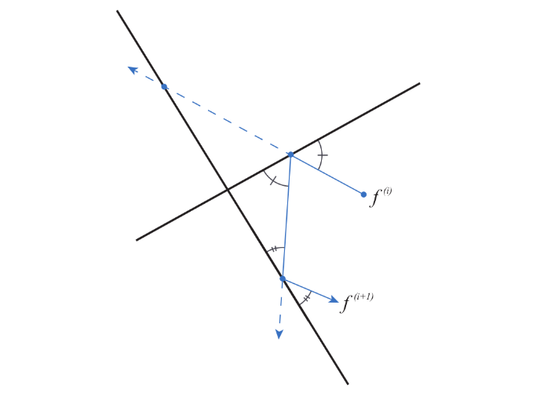
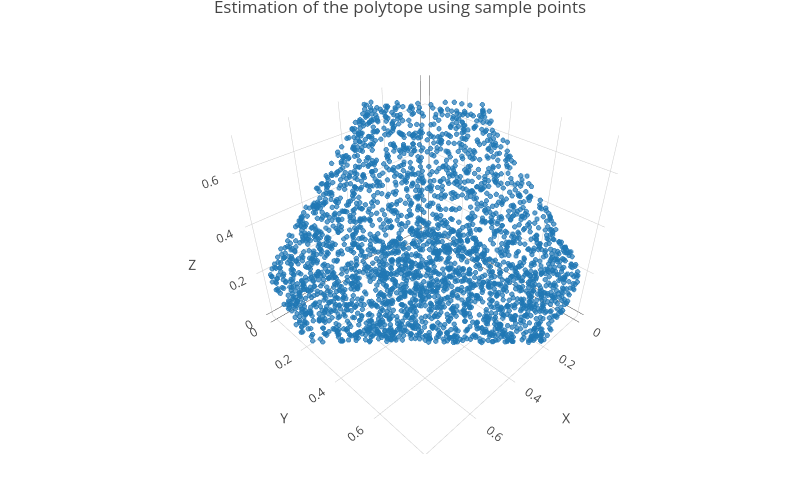

The package `{samplelim}` for the R statistical software provides an efficient implementations (C++ encoded) of Markov Chain Monte Carlo  (MCMC) algorithms for uniformly sampling high-dimensional polytopes.
It aims particularly  at handling linear inverse models (LIM) in metabolic (trophic, biochemical or urban) networks.
Some support functions are also included that facilitate its use by practitioners.

## Objective

`{samplelim}` implements two MCMC algorithms for sampling high-dimensional polytopes, the Mirror Walk (MiW) introduced by Van Oevelen _et al._ (2010) and the Billiard Walk (BiW) introduced by Polyak and Gryazina (2014). 
Thanks to the inclusion of easy to use support functions for linear inverse modeling of metabolic networks, `{samplelim}` updated, extended, low-level-encoded, version of the R package [`{limsolve}`](https://cran.r-project.org/web/packages/limSolve/index.html), that includes easy to use support functions for linear inverse modeling of metabolic networks.

`{samplelim}` is built upon the C++ library [`{volesti}`](https://github.com/GeomScale/volesti). Precisely, the source code of the R package `{volesti}` 1.1.2-6 has been forked from its [GitHub repository](https://github.com/GeomScale/volesti/releases/tag/v1.1.2-6) as a basis for developing `{samplelim}`.

The C++ library  `{volesti}` provides efficient implementations of different MCMC algorithms for sampling high-dimensional polytopes and estimating their volumes. The R package counterpart proposes a subset of these algorithms among which the BiW.

`{samplelim}` aims at combining the performance of `{volesti}` with the convenient for practitioners features of `{limsolve}` :

  * the MiW is implemented in an optimized C++ encoded version of the version encoded in pure R programming language in `{limsolve}`;
  * `{samplelim}` includes and slightly modifies the BiW from `{volesti}` 1.1.2-6 --  the uniform distribution of the path length being replaced by the exponential distribution, as originally suggested by Polyak and Gryazina (2014);
  * support functions allowing an easy handling by users are included. These functions are updated/modified versions of the original ones present in `{limsolve}`.

## Definitions
### Reflective algorithms

`{samplelim}` implements two sampling algorithms called  Mirror
Walk (MiW) an  Billiard Walk (BiW), that rely on a reflection mechanism on the borders of the polytope to be sampled. Their general principle consists in drawing randomly the direction and path length of a segement as in the classical hit-and-run algorithm. However, if the trajectory reaches a border of the polytope before the random path length is achieved, then it is reflected on this border, moving forward this reflected direction for the remaining distance. This is repeated until the trajectory finally reaches a point within the polytope. Then, new direction and path length are randomly chosen, and so on.

```{r, echo=FALSE, fig.align='center', out.width='50%', fig.cap="Reflection of the path in the MiW and BiW algorithms"}

```
### Jump length

Both the MiW and the BiW algorithms use a parameter called "jump length" (`jmp`) in drawing the direction and length of the segment.

This is an important parameter: if its value is too small, exploration of the polytope will not be efficient and would require a very large number of points . Conversely, if the jump is too big the sampling process could take time because the trajectory of the chain may reach borders of the polytope and hence many reflections will need to be computed. 

The precise definition of the jump differs between the two algorithms:

  * For the MiW, direction and length are obtained as the direction and norm of a vector $v$, where $v$ is s drawn from a centered non correlated Gaussian vector $V = (V_1,...,V_n)$ with Var $V_i = \sigma_i^2$. The vector $\sigma^2=(\sigma_1^2,...,\sigma_n^2)$ is called the **jump length**.

  * For the BiW, the direction is drawn from the uniform distribution on the unit sphere of $\mathbb{R}^n$ and the path length is $L=\tau \log(1/U)$ where $U$ is drawn from a uniform distribution on $[0, 1]$. The **jump length** is the parameter $\tau > 0$.

### Thinning and burn-in

To achieve an MCMC sample closer to a sample of a uniform distribution, two integer parameters are to be used: the burn-in (`burn`) and the thinning (`thin`).

Let a sample be obtained as described above. Then,

  * The first values of the sample are correlated with the starting point and far from the limit uniform distribution of the chain. Thus, the burn-in parameter is the number of first values to be discarded from the sample.

  * Consecutive points of a Markov chain are highly correlated. Thus, the thinning parameter is the number of points to be discarded between points kept in the final sample.

For more information about choosing the burn-in and thinning values, see Section [The Raftery and Lewis diagnostic]. 

## The polytope to be sampled

An intersection of hyper-planes and half-spaces defines an $n$-dimensional convex set known as a polytope $\mathcal{P}$.
In mathematical words, $\mathcal{P} = \{ x \in \mathbb{R}^n: Ax = B, Gx \geq H \}$, 
where $A$ is an $m\times n$ matrix, with $m \leq n$, $B \in \mathbb{R}^m$, $G$ is a $k \times n$ matrix, with $k \geq 0$ and $H \in \mathbb{R}^k$. Inequality constraints, represented by the matrix $G$, always present in linear inverse models for metabolic networks, make the polytope bounded.

For the mere aim of illustration, we will consider in the following the minimal toy example defined by the constraints

$$\begin{cases}
  1x_1 + 1x_2 + 1x_3 = 1 \\
  0x_1 + 0x_2 + 1x_3 \geq 0.7 \\
  0x_1 + 0x_2 - 1x_3 \geq 0 \\
  0x_1 + 1x_2 + 0x_3 \geq 0.8 \\
  0x_1 - 1x_2 + 0x_3 \geq 0 \\
  1x_1 + 0x_2 + 0x_3 \geq 0.8 \\
  -1x_1 + 0x_2 + 0x_3 \geq 0 \\
\end{cases}$$

with associated matrices $$
\mathbf{A} = \begin{pmatrix}
1 & 1 & 1 
\end{pmatrix}, \quad
\mathbf{B} = \begin{pmatrix}
1
\end{pmatrix}, \quad
\mathbf{G} = \begin{pmatrix}
  0 & 0 & 1 \\
  0 & 0 & -1 \\
  0 & 1 & 0 \\
  0 & -1 & 0 \\
  1 & 0 & 0 \\
  -1 & 0 &0
\end{pmatrix},\quad
\mathbf{H} = \begin{pmatrix}
0.7 \\
0 \\
0.8 \\
0 \\
0.8 \\
0
\end{pmatrix}$$.

The main argument `lim` of `rlim()` is a list with (at least) four components named `A`, `B`, `G` and `H`, that are the matrices and vectors defining the polytope to be sampled. Below those components are set with the values of the toy model.

```{r minimalexample, echo = TRUE, eval = FALSE}
library("samplelim")
# Define equality and inequality constraints through matrices A, B, G, H
A <- matrix(c(1, 1, 1), nrow = 1, ncol = 3)
B <- 1
G <- -matrix(c(0, 0, 1,
              0, 0, -1,
              0, 1, 0, 
              0, -1, 0,
              1, 0, 0, 
              -1, 0, 0),
            byrow = TRUE,
            nrow = 6, ncol = 3)
H <- -matrix(c(0.7, 0, 0.8, 0, 0.8, 0), nrow = 6)
# Store into a list
lim_exm <- list(A = A, B = B,G = G,H = H)
# Sampling into the polytope defined by these constraints
sample <- rlim(lim_exm)
# Show first points of the sample with the head function
head(sample)
```

```{r minimalexample_with_seed, echo = FALSE}
# Duplicate to have reproducible example without presenting seed yet
library("samplelim")
# Define equality and inequality constraints through matrices A, B, G, H
A <- matrix(c(1, 1, 1), nrow = 1, ncol = 3)
B <- 1
G <- -matrix(c(0, 0, 1,
              0, 0, -1,
              0, 1, 0, 
              0, -1, 0,
              1, 0, 0, 
              -1, 0, 0),
            byrow = TRUE,
            nrow = 6, ncol = 3)
H <- -matrix(c(0.7, 0, 0.8, 0, 0.8, 0), nrow = 6)
# Store into a list
lim_exm <- list(A = A, B = B,G = G,H = H)
# Sampling into the polytope defined by these constraints
sample <- rlim(lim_exm, seed = 123)
# Show first points of the sample with the head function
head(sample)
```

The sample generated by `rlim()` can be visualized thanks to a 3D scatterplot.

```{r vizminexm, message = FALSE, eval=FALSE}
# Preparing sample for 3D scatterplot
colnames(sample) <- c("X", "Y","Z")
sample <- as.data.frame(sample)
library("plotly")
plot_sample <- plot_ly(sample, x = ~X, y = ~Y, z = ~Z, size = 0.2)
plot_sample <- plot_sample %>% add_markers()
plot_sample <- plot_sample %>% layout(title = "Estimation of the polytope 
              using sample points")
plot_sample
```


## Sampling the polytope for a model defined in a file

First the model saved in DeclarationFileBOWF-short.txt file is imported and converted into a `lim` object using `df2lim()`.

```{r examplefileimport}
DF <- system.file("extdata", "DeclarationFileBOWF-short.txt", package = "samplelim")
model <- df2lim(DF)
```

All the attributes of the model are listed as follows.

```{r examplefileattributes}
att <- attributes(model)
att
```

These attributes can be accessed by using '$attribute', for example variable names.

```{r variable_name}
model$Variables
```

Theoretical ranges for all variables can be determined using the `lim.ranges()` function. It provides a lower bound, an upper bound, and the range (length of the interval between bounds).

```{r examplefileranges}
lim.ranges(model)
```

The sampling of the polytope is obtained by using the `rlim()` function.

```{r rlim_ex_file1, echo = TRUE, eval = FALSE}
sample <- rlim(model, nsamp=5000)
head(sample)
```
```{r rlim_ex_file2, echo = FALSE}
# Duplicate to have reproducible example without presenting seed yet
sample <- rlim(model, nsamp=5000, seed = 123)
head(sample)
```

Note that the above sequence of draws **must not** be studied as a representative sample of the polytope, since its parameters
(thinning, burning, sample size) were not chosen accurately.

A new sample has to be computed, using the correct parameters obtained via the [Raftery and Lewis diagnostics](#raftery_lewis) from this initial sequence of draws.

## Evaluating the quality of a sample using performance diagnostics

Multiple statistical tools and criterion, usually known as "diagnostics", exist to evaluate the convergence of MCMC algorithms. They are to be applied to sequences of draws and performed separately for each variable (each flow), inducing some insight on the uniformity of the distribution of draws. Here are some diagnostics that are of use in [Girardin et al.](https://hal.science/hal-04455831/document), where references are given.

### The Raftery and Lewis diagnostic  {#raftery_lewis}

The main principle behind the Raftery and Lewis diagnostic is that a correct sample of the objective distribution, here the uniform distribution, should give precise estimates of its quantiles. Usually the 0.025 quantile is used.

This diagnostic provides multiple pieces of information, such as the burning value (M), an estimate of the sample size to ensure precise estimation of a prescribed quantile (N), a lower bound (Nmin), and a dependence factor (I).

The dependance factor assesses the extent to which auto-correlation inflates the required sample size; values
larger than 5 indicate a strong auto-correlation.

Raftery and Lewis diagnosticperforms as follows.
```{r RL_diag}
q <- 0.025
RL <- coda::raftery.diag(data = sample, q=q)
RL
```
Note that the value of the flow "FIX->PHY" is here greater than 5, indicating a strong auto-correlation.

The maximum burn-in value and estimate sample size are to be used to improve the sampling.
```{r RL_diag2, eval=FALSE}
# Get the maximum value of 'Burn-in' (Burn-in is the first column)
max_burn <- max(RL$resmatrix[,1])
# Get the maximum value of 'Thinning' (Burn-in is the fifth column)
max_thin <- max(RL$resmatrix[,5])
# Get the maximum value of 'Total (N)' (Total (N) is the second column)
max_total <- max(RL$resmatrix[,2])

# Sampling again with those new parameters
better_sample <- rlim(model, nsamp = max_total, thin = max_thin, burn = max_burn)
```

### The Geweke diagnostic

The Geweke diagnostic is a classical statistical test of comparison of means applied to prescribed proportions of the first and last points generated by an MCMC algorithm, say $0 < p_1 < 1$ and $0 < p_2 < 1$, with $p_1 + p_2 < 1$. If the difference
of means is too large, the null hypothesis of convergence is rejected. The values $p_1 = 0.1$ and $p_2 = 0.5$ are usual.

For each variable, a value $Z$ is computed, the hypothesis of convergence of the algorithm is rejected if $\left| Z \right|$ exceeds a prescribed quantile of the normal distribution. With $p_1 = 0.1$ and $p_2 = 0.5$, convergence is rejected when $\left| Z \right| \geq 1.28$. 

```{r geweke_diag}
frac1 <- 0.1
frac2 <- 0.5
G <- coda::geweke.diag(sample, frac1 = frac1, frac2 = frac2)
G
```
Note that some values above are greater than 1.28.
```{r}
# View flows with |Z| greater than 1.28
abs(G$z)>=1.28

# Count the number of flows with |Z| greater than 1.28
sum(abs(G$z)>=1.28)
```

### Effective Sample Size

The Effective Sample Size (ESS) reflects the amount of autocorrelation in the MCMC draws. The closer ESS is to N (the sample
size), the better, since it means that the draws are lowly auto-correlated.
```{r ESS_diag}
coda::effectiveSize(sample)
```

## Adjusting sampling methods and parameters

Users can choose the sampling method, the size of the sample and the values of parameters such as the jump length.

### Choosing the sample size and sampling method

By default, `rlim()` samples 3000 points using the Mirror Walk algorithm.

The sample size can be chosen as follows.

```{r adjusting_ex1, eval = FALSE}
# Set the number of points to sample to 10000 using nsamp
big_sample <- rlim(model, nsamp = 10000)
dim(big_sample)
```

The algorithm can be changed using the "type" argument. "BiW" for the Billiard Walk, nothing or "MiW" for the Mirror Walk.

```{r adjusting_ex2, eval = FALSE}
# Use the Billiard Walk algorithm by specifying "BiW" for the type
billiard_sample <- rlim(model, type = "BiW")

# Use the Mirror Walk algorithm by specifying "MiW" for the type
mirror_sample <- rlim(model, type = "MiW")
# Mirror Walk is also used when type has no value
mirror_sample <- rlim(model)
```


### Adjusting the value of the jump

The choice of the jump is of real importance even if finding an optimal value is a difficult task. By default, `{samplelim}` uses an "adaptative jump" defined as one tenth of each range of the [reduced polytope](#reduced_polytope).

```{r jump_ex1}
# Sampling with default jump (adaptative jump)
default_jump_sample <- rlim(model, nsamp = 1000, type="MiW")

# Get the value of the adaptative jump
# Reduce the polytope
model_reduced <- lim.redpol(model)
# Obtain the ranges of the reduced polytope and divide them by 10
ada_jump <- pol.ranges(G=model_reduced$G,H=model_reduced$H)[,3]/10
ada_jump
```

Custom jump may be used, any positive value $\sigma²$ for the BiW, and any vector value $\sigma^2=(\sigma_1 ²,...,\sigma_n²)$ for the MiW. Note that the length $n$ of the vector is the dimension of the reduced polytope. Usually the default choice is quite good, custom jumps are to be avoided without valid arguments.

```{r jump_ex2}
# Billiard Walk
# Set sigma^2 value
sigma2 <- 1
# Sample with chosen jump value
sample_biw <- rlim(model, nsamp = 1000, type = "BiW", jmp=sigma2)

# Mirror Walk
# Get the dimension of the reduced polytope
n=dim(lim.redpol(model)$G)[2]
n

# Create a vector of length n with sigma_i^2 = 4
sigma2_vec= rep(4,n)
# Sample with chosen jump vector
sample_miw <- rlim(model, nsamp = 1000, type = "MiW", jmp=sigma2_vec)
```

## Create reproducible examples

In certain situations, one may need to provide reproducible examples, for instance in scientific publications. Reproducibility ensures that the results remain consistent when the code is rerun, which is particularly important when randomness is involved.

To ensure a reproducible example a parameter called "seed", that can be any integer, is needed with the `rlim()` function. As far as the other parameters are unchanged a same seed will produce the same sample.

The following example generate three samples (two using the same seed and one with a different) using `rlim()`. The samples are then compared in order to check the consistency of the seed.

```{r reproducible_example}
# Set the seeds
seed1 <- 123
seed2 <- 456 

# Generate the samples
sample1 <- rlim(model, nsamp = 500, seed = seed1)
sample2 <- rlim(model, nsamp = 500, seed = seed1)
sample3 <- rlim(model, nsamp = 500, seed = seed2)

# Compare the samples by checking if all the values are the same
print(paste("Are sample1 and sample2 the same ? ", all(sample1 == sample2)))
print(paste("Are sample1 and sample3 the same ? ", all(sample1 == sample3)))
```


## Working with a reduced polytope {#reduced_polytope}

The sampling process uses a reduced polytope. The polytope $\mathcal{P} = \{ x \in \mathbb{R}^n: Ax = B, Gx \geq H \}$ is reduced to a polytope $\mathcal{P'} = \{ x \in \mathbb{R}^{n-k}: G'x \geq H' \}$ with full rank $n-k$, with $k$  the rank of the matrix $A$, $G' = GZ$, $H' = H-Gx_0$, where the matrix $Z$ is the basis of the right null space of $A$. Further, $x_0$ is a particular solution in $\mathcal{P}$.

> **Note:** The following section is more theoretical and advanced. Studying the reduced polytope may be of interest to advanced readers but may be ignored by practitioners. For more information, see [Yao and Kane.](http://cran.nexr.com/web/packages/walkr/vignettes/walkr.pdf)

The components of the reduced polytope are obtained from the full polytope by using `lim.redpol()`.

```{r projected_polytope_example}
# Get the full polytope
DF <- system.file("extdata", "DeclarationFileBOWF-short.txt", package = "samplelim")
full <- df2lim(DF)
# Project the polytope
reduced <- lim.redpol(full)
# Comparison of the shape of the constraint matrices of the two polytopes
# full
dim(full$G)
# projected
dim(reduced$G)
```

```{r get_project_polytope_comps, eval = FALSE}
# Get k the rank of the matrix A
k <- qr(full$A)$rank
# Get the Z matrix
reduced$Z
# Get the particular solution x0
reduced$x0
# Get the matrix G'
reduced$G
# Get the vector H'
reduced$H
```

The reduced polytope can now be sampled. The obtained sample leads to a sample of the full polytope by using `red2full()` in which the particular solution $x_0$ and the matrix $Z$ have to be given.

```{r red2full_example}
# Sampling the reduced polytope
sample_reduced <- rlim(reduced)
head(sample_reduced)
# Turn sampled points of the reduced polytope into sampled points of the full polytope
sample_full <- red2full(sample_reduced, reduced$x0, reduced$Z)
```

Conversely, note that a sample of the full polytope can also be turned into a sample of the reduced polytope with `full2red()`.

```{r full2red_example}
sample_reduced2 <- full2red(sample_full, reduced$x0, reduced$Z)
```

## Performance comparison between limSolve and samplelim

This section compare the execution time of the `xsample()`function from `{limSolve}` and the `rlim()` function from `{samplelim}`. Both functions use here the same MiW algorithm and the same sample size (1000 points).

```{r comparison, message = FALSE, warning = FALSE}
library("limSolve")

# Execution time for xsample (limSolve)
start_time1 <- Sys.time()
sample1 <-xsample(E = model$A, F = model$B, G = model$G, H = model$H, iter = 1000)
end_time1 <- Sys.time()
time1 <- end_time1 - start_time1

print(paste("Time for xsample():", round(time1,3), "seconds"))

# Execution time for rlim (samplelim)
start_time2 <- Sys.time()
sample2 <- rlim(model, nsamp = 1000)
end_time2 <- Sys.time()
time2 <- end_time2 - start_time2

print(paste("Time for rlim():", round(time2,3), "seconds"))
```
Even with a small sample size, `rlim()` outperforms `xsample()`. This performance advantage increases with the sample size.

## Plot distributions of sample variables

Distribution of sample variables as well as scatter plots for pairs of variables can be shown using the `ggpairs()` function. For a better visibility, it is recommended not to take more than 5 variables at the same time. The indexes of the desired variables must be selected manually. In this example we consider the variables involving the BAC compartment. 

```{r pair_plot, message = FALSE}
# ggpairs() needs the GGally package 
library("GGally")

# The sample needs to be converted as a data.frame
sampleDF=as.data.frame(sample)

# View all the variables names and their indexes
vars <- names(sampleDF)
print(rbind(1:length(vars), vars))

# Choose the index of desired variables 
keep <- c(5,10,12,13,14)

# Plot the pairs plot
ggpairs(sampleDF,columns=keep, lower=list(continuous=wrap("points",alpha=0.3,size=0.1),
combo=wrap("dot",alpha=0.4,size=0.2)),title ="PairPlot")
```
For each plot, the name of the first variable is at the top and the name of the
second  on the right. Graphs on the diagonal are distribution plots.
The graphs at bottom left are scatter plots, and the values at top right
are Pearson correlation coefficients between the two associated variables.
